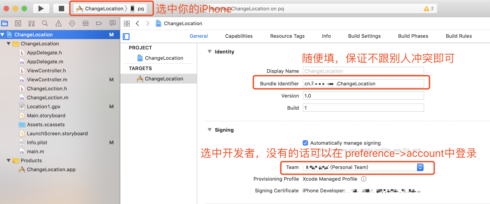

# 非iOS开发人员手把手教程

## 连接
数据线连接，没啥说的。

## 项目配置
1. 设备选择
2. 包ID设置
3. 开发者设置



## 代码修改
修改```ViewController.m```文件
1. 去[高德地图](http://lbs.amap.com/console/show/picker)，选中自己坐标
2. 将调用```CLLocationCoordinate2DMake```方法的参数修改为自己的坐标
3. 将31行在控制台打印的的经纬度填入```Location1.gpx```文件中（注意：这一步骤需要运行才能获取，可以通过模拟器运行得到）

## 真机调试
1. 点击运行
2. 将iPhone的设置 -> 通用 -> 设备管理 中，设为信任
3. 此时重新运行，如有问题，重启iPhone再试，一般这时候就已经成功了
